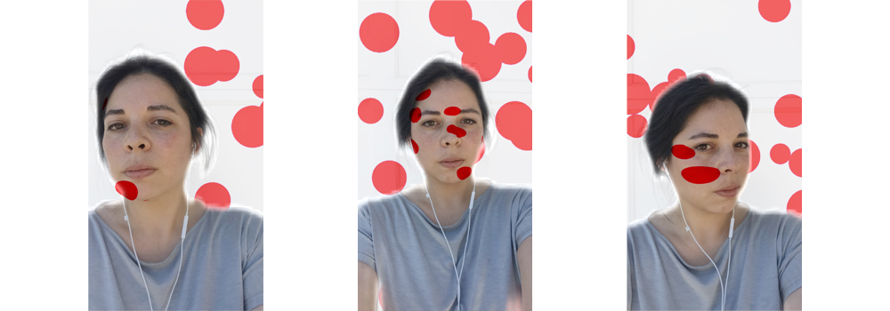

  

    {{page.page-title}}
  

  

    {{page.tags}}
  

  

  

    

      
Sea Sponge Masks

      
Sea Sponge Masks started as a collaboration with artist Genevieve Tremblay for the Seattle Art Museum’s annual Dinner Party in the Park fundraiser. Drawing inspiration from the glass sponge research of marine biologist Dr. Henry M. Reiswig, I designed a series of celebratory laser cut masks as a fun take away for our table. The masks were later shared with the participants of various ASKXXI (Arts + Science Knowledge in the XXIst Century) associated initiatives. During COVID-19, I started learning Spark AR and decided to convert these masks into a filter that could be shared for online events. The filter allows the user to tap and change to whichever sea sponge style suits them best.

    

    <iframe title="vimeo-player" src="https://player.vimeo.com/video/565818804?autoplay=1&loop=1&autopause=0&muted=1" width="288" height="512" frameborder="0" allowfullscreen></iframe>
  

  

  

    
Kusamish

    
Kusamish is a Yayoi Kusama inspired filter I made to practice Spark AR techniques including 3D object transformation, user segmentation, animated SDF background and lighting features.

  

  <iframe title="vimeo-player" src="https://player.vimeo.com/video/565809260?autoplay=1&loop=1&autopause=0&muted=1" width="288" height="512" frameborder="0" allowfullscreen></iframe>

<iframe title="vimeo-player" src="https://player.vimeo.com/video/565909587?autoplay=1&loop=1&autopause=0&muted=1" width="980" height="512" frameborder="0" allowfullscreen></iframe>

  

    

      
Polka Blink

      
Another Yayoi Kusama inspired filter that generated new red polka dots in the background and on a face mesh when the face tracker captures the user blinking. Made to practice face tracking interaction and  shader render pass patches.

    

    <iframe title="vimeo-player" src="https://player.vimeo.com/video/566294422?autoplay=1&loop=1&autopause=0&muted=1" width="288" height="512" frameborder="0" allowfullscreen></iframe>

  

  

<!-- /.blurb -->

